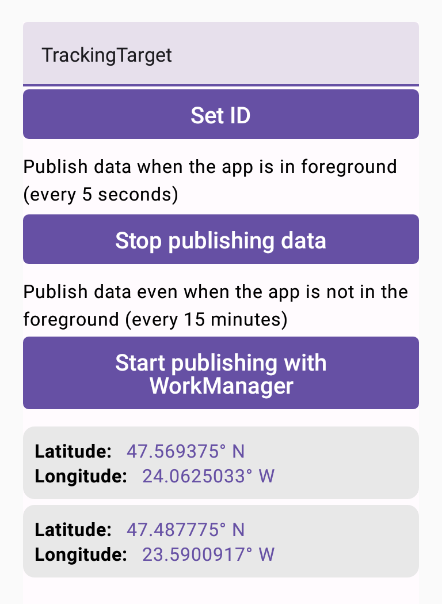
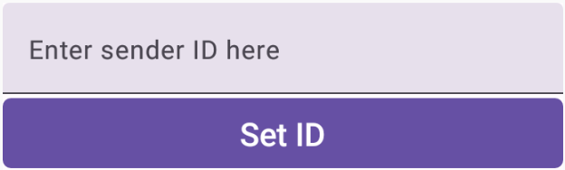
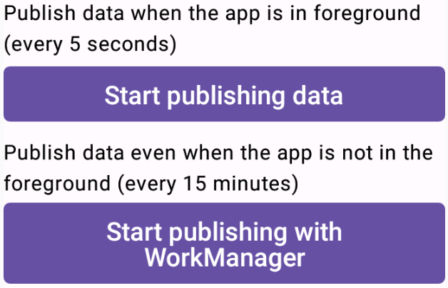
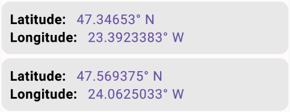

# 🖲️ TrackerLocationSender

This app obtains the current location of the device and sends it to a MQTT broker every 5 seconds 
(or every 15 minutes through a WorkManager). The location would be consumed by [TrackerLocationConsumer](https://github.com/MadalinDolca/TrackerLocationConsumer).

🗓️ Developed during a summer intership at Cognizant

MQTT is a lightweight protocol for exchanging messages between devices in a publish-subscribe fashion.

This protocol has 3 main components:

1. **Client**: can be any device, in this case the app, that can communicate through this protocol.
   If it sends messages it acts as a **publisher**, if it receives messages it acts as a **receiver**.
2. **Broker**: is the system backend that filters and coordinates the messages to the clients.
3. **Topic**: is a keyword used by the Broker to filter the messages.

## Way of operation

After connecting to the Broker, a Client can publish messages to a specific topic, in this case `tracker/location`.
If the same or another client wants to receive messages, it has to **subscribe** to a certain topic like the above one.
When a client is publishing messages to a topic, the Broker will send that message to every subscriber of that topic.
Clients can publish/subscribe to multiple topics.

## How to publish the messages

Launch the app, make sure that you have network connectivity and allow it to use the device's location.

You can *optionally* set a sender ID in the below text field and press the **Set ID** button, 
otherwise `TrackerLocationSender` will be used.

The messages can be published in two ways:

1. Click the `Start publishing data` - it will fetch the current location and send the coordinates 
every 5 seconds, but it will work only when the app is in foreground
2. Click the `Start publishing with WorkManager` - it will fetch the current location and send the 
coordinates every 15 minutes even if the app is not in foreground

If you're using the first method, the coordinates will be shown in-app

## How to receive messages

In order to see the published messages (coordinates) by the app, open this 
[Web Client](https://www.hivemq.com/demos/websocket-client/) and follow the steps.

### 1. Connect to the broker

In the **Connection** fill in the following fields like in the below picture:

- Host: `868b4e59e6c341379e82120b3e1d456e.s2.eu.hivemq.cloud`
- Port: `8884`
- Username: `location_consumer`
- Password: `Consumer123`

Ignore the rest and press the **Connect** button.

### 2. Subscribe to a Topic

Expand the **Subscriptions** section by clicking on the right arrow and click on the **Add New Topic Subscription** button.

Now you have to enter the name of the topic for which you want to receive messages, in this case `tracker/location`.
Ignore the rest and press the **Subscribe** button.

### 3. Read the messages

Expand the **Messages** section by clicking on the right arrow to see the messages sent to the Topic you subscribed to.

